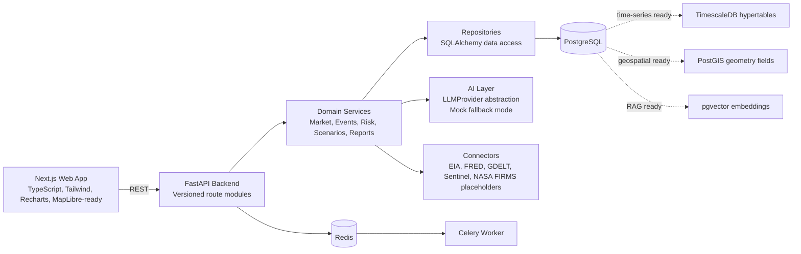
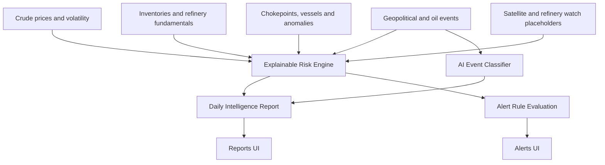

# Oil Intelligence AI

<p align="center">
  <strong>Enterprise-grade oil market intelligence platform powered by AI, market data, geopolitical event analysis, maritime risk, and scenario modeling.</strong>
</p>

<p align="center">
  
  
  
  
</p>

<p align="center">
  <a href="#screenshots">Screenshots</a> |
  <a href="#architecture">Architecture</a> |
  <a href="#quick-start">Quick Start</a> |
  <a href="#api-surface">API</a> |
  <a href="#roadmap">Roadmap</a>
</p>

<p align="center">
  
</p>

## Product Vision

Oil Intelligence AI is an AI-native energy intelligence platform for monitoring crude oil prices, petroleum fundamentals, geopolitical events, maritime chokepoints, refinery and storage signals, satellite placeholders, upstream field intelligence, and scenario analysis.

The MVP is designed as a clean full-stack foundation that can grow into a serious energy intelligence system with AIS tanker tracking, satellite imagery, storage tank monitoring, reservoir and well production data, OSDU/WITSML-style datasets, and real-time market/event ingestion.

## Screenshots

### Landing Experience


### Global Intelligence Dashboard


## What It Does

| Area | Capability |
| --- | --- |
| Market intelligence | Brent/WTI time series, OHLC/value support, price moves, volatility-ready analytics |
| Petroleum fundamentals | Inventories, production, imports, exports, demand, refinery utilization |
| Event intelligence | Geopolitical, refinery, maritime, macro and oil-impact classification |
| Risk scoring | Global oil risk plus geopolitical, maritime, supply, demand, refinery and volatility subscores |
| Scenario analysis | Base, bullish and bearish cases for disruptions, OPEC changes, hurricanes and demand shocks |
| Daily reports | AI-style daily oil intelligence brief with risk drivers, market summary and monitoring signals |
| Alerts | Rules for large price moves, high risk scores, refinery events, chokepoint disruption and inventory drawdowns |
| Maritime module | Chokepoints, vessels, tanker routes, anomalies and MapLibre-ready geospatial UI |
| Satellite placeholder | Refinery, storage, fire and spill observation interfaces for future provider integrations |
| Reservoir placeholder | Fields, reservoirs, wells, production history, forecast and decline-curve architecture |

## Architecture



## Intelligence Pipeline



## Monorepo Structure

```text
.
|-- apps/
|   |-- api/                     # FastAPI backend
|   |   |-- app/
|   |   |   |-- api/routes/      # HTTP endpoints
|   |   |   |-- clients/         # External data adapters, mock-capable
|   |   |   |-- core/            # Settings, DB session, app config
|   |   |   |-- models/          # SQLAlchemy models
|   |   |   |-- repositories/    # Data access layer
|   |   |   |-- schemas/         # Pydantic API contracts
|   |   |   |-- services/        # Domain and AI services
|   |   |   |-- seed/            # Sample data pipeline
|   |   |   `-- workers/         # Celery tasks
|   |   `-- alembic/             # Migration setup
|   `-- web/                     # Next.js enterprise dashboard
|-- docs/                        # Architecture, API, roadmap and screenshots
|-- docker-compose.yml           # Local full-stack services
|-- Makefile                     # Developer commands
|-- package.json                 # Frontend workspace scripts
`-- README.md
```

## Core Modules

| Module | Backend | Frontend |
| --- | --- | --- |
| Market Data | `/api/market/prices` | `/market`, dashboard cards and charts |
| Fundamentals | `/api/market/fundamentals` | Fundamentals table |
| Events | `/api/events`, `/api/events/classify` | `/events`, timeline and classification UI |
| Risk | `/api/risk/summary` | `/risk-center`, dashboard risk cards |
| Scenarios | `/api/scenarios/generate` | `/scenarios`, scenario studio form |
| Maritime | `/api/maritime/*` | `/maritime`, `/maritime-map` |
| Satellite | `/api/satellite/summary` | `/satellite` |
| Fields | `/api/fields/summary` | `/fields` |
| Reports | `/api/reports/daily`, `/api/reports/generate` | `/reports` |
| Alerts | `/api/alerts/*` | `/alerts` |

## Quick Start

### Option 1: Docker Compose

```bash
cp .env.example .env
docker compose up --build
```

Open:

- Frontend: `http://localhost:3000`
- API docs: `http://localhost:8000/docs`
- Health check: `http://localhost:8000/health`
- Readiness check: `http://localhost:8000/health/ready`

### Option 2: Local Development

Backend:

```bash
cd apps/api
pip install -e .[dev]
uvicorn app.main:app --reload
```

Frontend:

```bash
cd apps/web
npm install
npm run dev
```

Useful commands from the repository root:

```bash
make dev
make backend
make frontend
make test
make lint
make seed
make down
```

## API Surface

The canonical API is now versioned at `/api/v1/*`. Legacy `/api/*` routes remain available for compatibility.

| Method | Endpoint | Purpose |
| --- | --- | --- |
| `GET` | `/health` | Service health check |
| `GET` | `/health/live` | Liveness probe |
| `GET` | `/health/ready` | Readiness probe (Postgres + Redis) |
| `GET` | `/api/v1/market/prices` | Versioned prices endpoint with pagination metadata |
| `GET` | `/api/v1/events` | Versioned events endpoint with pagination metadata |
| `GET` | `/api/v1/maritime/routes` | Versioned maritime routes endpoint with pagination metadata |
| `GET` | `/api/v1/alerts/events` | Versioned alert events endpoint with pagination metadata |
| `GET` | `/api/market/prices` | Crude and commodity price series |
| `GET` | `/api/market/fundamentals` | Petroleum fundamentals |
| `GET` | `/api/events` | Oil-relevant events and news |
| `POST` | `/api/events/classify` | AI/rule-based event classification |
| `GET` | `/api/risk/summary` | Explainable global oil risk summary |
| `POST` | `/api/scenarios/generate` | Scenario analysis generation |
| `GET` | `/api/maritime/chokepoints` | Maritime chokepoint dataset |
| `GET` | `/api/maritime/vessels` | Sample tanker and vessel entities |
| `GET` | `/api/maritime/routes` | Sample tanker routes |
| `GET` | `/api/maritime/risk-summary` | Maritime risk summary |
| `GET` | `/api/satellite/summary` | Remote sensing placeholder summary |
| `GET` | `/api/fields/summary` | Field and well intelligence summary |
| `GET` | `/api/reports/daily` | Daily oil intelligence report |
| `POST` | `/api/reports/generate` | Generate a daily report payload |
| `GET` | `/api/reports/daily/pdf` | Export daily report to PDF |
| `GET` | `/api/alerts/rules` | Alert rule definitions |
| `GET` | `/api/alerts/events` | Triggered alert events |
| `POST` | `/api/alerts/evaluate` | Evaluate alert rules |

## Example Requests

Get Brent/WTI prices:

```bash
curl "http://localhost:8000/api/market/prices?symbol=BRENT&limit=20"
```

Classify an oil event:

```bash
curl -X POST "http://localhost:8000/api/events/classify" \
  -H "Content-Type: application/json" \
  -d '{
    "headline": "Refinery outage in Gulf Coast",
    "description": "Emergency maintenance cuts distillate output",
    "source": "manual"
  }'
```

Generate a scenario:

```bash
curl -X POST "http://localhost:8000/api/scenarios/generate" \
  -H "Content-Type: application/json" \
  -d '{
    "scenario_title": "Strait of Hormuz disruption",
    "event_description": "Escalating conflict impacts tanker flows",
    "affected_region": "Middle East",
    "affected_asset": "Shipping lanes",
    "horizon_days": 30,
    "severity": "high"
  }'
```

## Frontend Pages

| Route | Screen |
| --- | --- |
| `/` | Landing page |
| `/dashboard` | Global intelligence dashboard |
| `/market` | Market data and price analytics |
| `/events` | Event intelligence timeline |
| `/scenarios` | Scenario generator |
| `/maritime` | Maritime intelligence overview |
| `/maritime-map` | MapLibre-ready maritime map |
| `/risk-center` | Explainable risk center |
| `/reports` | Daily intelligence reports |
| `/alerts` | Alert rules and triggered alerts |
| `/satellite` | Satellite watch placeholders |
| `/fields` | Reservoir and field intelligence |
| `/settings` | Configuration and mock-mode status |

## Data and Mock Mode

The project is designed to run without paid APIs or external credentials. If provider keys are missing, services fall back to deterministic sample data and mock analysis.

Sample datasets include:

- Brent and WTI time series
- Petroleum inventory and refinery utilization records
- Geopolitical and refinery events
- Maritime chokepoints, vessels, routes and anomalies
- Satellite refinery, fire and spill observations
- Oil field, reservoir and well production records
- Scenario templates for OPEC, Red Sea, Hormuz, hurricanes, sanctions and demand shocks

## Target Users

| User group | Use case |
| --- | --- |
| Oil traders | Event-driven risk and price monitoring |
| Commodity analysts | Daily market intelligence and scenario narratives |
| Logistics companies | Chokepoint and tanker route risk awareness |
| Fuel distributors | Inventory, refinery and supply disruption monitoring |
| Banks and research teams | Structured oil-market briefings and risk scoring |
| Energy companies | Integrated upstream, downstream and maritime intelligence foundation |
| Maritime intelligence teams | AIS-ready architecture for future vessel data integration |

## Quality and Engineering Notes

- Backend uses FastAPI, Pydantic, SQLAlchemy and Alembic.
- Frontend uses Next.js, TypeScript, Tailwind CSS, shadcn-style components, Recharts and MapLibre-ready structure.
- AI services use a provider abstraction with deterministic fallback mode.
- Database models are designed for TimescaleDB, PostGIS and pgvector evolution.
- Redis and Celery are included as the async worker/cache foundation.
- Celery Beat scheduling is configured for market/event refresh and alert evaluation.
- Structured JSON request logging with `request_id` is enabled in the API middleware.
- API versioning now includes `/api/v1` with standardized pagination metadata on list endpoints.
- CI, pytest, linting and developer commands are included for baseline quality.

## Documentation

- [Architecture](./docs/architecture.md)
- [API Contract](./docs/api.md)
- [Data Sources](./docs/data-sources.md)
- [Roadmap](./docs/roadmap.md)
- [Business Use Cases](./docs/business-use-cases.md)

## Roadmap

| Phase | Focus |
| --- | --- |
| MVP | Mock-capable enterprise dashboard, risk engine, reports, alerts and scenario generation |
| Phase 1 | Real EIA/FRED/GDELT ingestion, persistent scheduling and richer event classification |
| Phase 2 | AIS provider integration, vessel tracking, port congestion and chokepoint route risk |
| Phase 3 | Satellite provider adapters, fire/spill detection workflows and storage site analytics |
| Phase 4 | Reservoir and well production loaders, decline analysis and OSDU/WITSML alignment |
| Phase 5 | RAG search, analyst copilot, portfolio watchlists and enterprise access controls |

## Disclaimer

Oil Intelligence AI is a research and demonstration project. It does not provide financial advice, trading advice, investment recommendations, or operational safety instructions. All sample data and mock analysis should be validated against trusted sources before real-world use.
