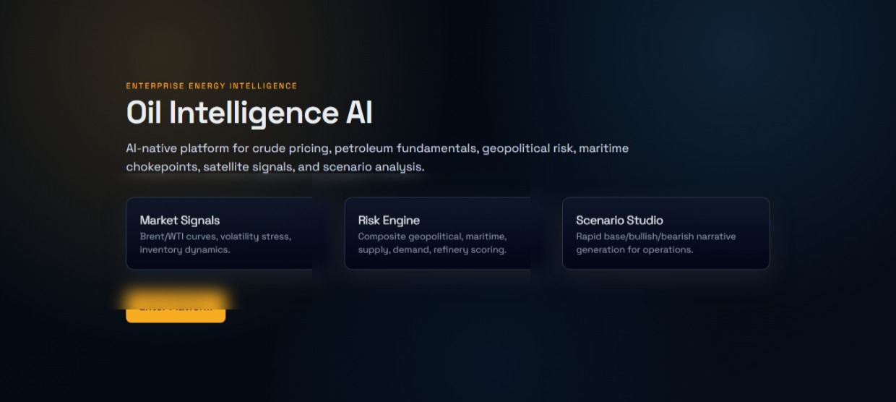
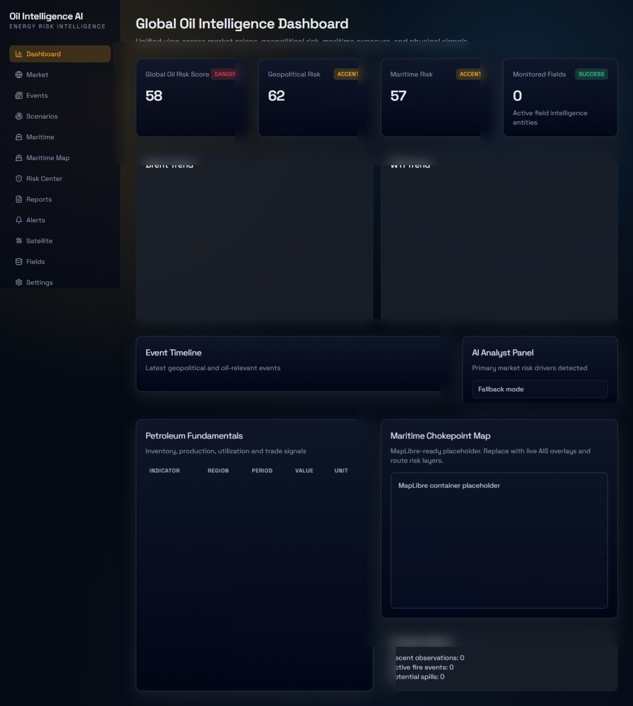

# 🛢️ Oil Intelligence AI

<p align="center">
  <strong>Plataforma de inteligência do mercado de petróleo e operações portuárias, powered by Inteligência Artificial.</strong><br/>
  <em>Monitoramento em tempo real de preços, riscos geopolíticos, rotas marítimas e cenários de mercado — tudo num só lugar.</em>
</p>

<p align="center">
  
  
  
  
</p>

<p align="center">
  <a href="#o-que-e">O que é</a> &nbsp;|&nbsp;
  <a href="#para-quem-trabalha-em-portos">Uso Portuário</a> &nbsp;|&nbsp;
  <a href="#funcionalidades">Funcionalidades</a> &nbsp;|&nbsp;
  <a href="#como-funciona">Como funciona</a> &nbsp;|&nbsp;
  <a href="#modulos">Módulos</a> &nbsp;|&nbsp;
  <a href="#roadmap">Roadmap</a>
</p>

<p align="center">
  
</p>

---

## 🌍 O que é isso?

O **Oil Intelligence AI** é uma plataforma digital de inteligência energética — pense nela como um **painel de controle inteligente** que reúne, organiza e interpreta automaticamente informações críticas sobre o mercado de petróleo, rotas de navios-tanque, riscos geopolíticos e movimentação portuária.

Em vez de você precisar acompanhar dezenas de fontes diferentes (notícias, relatórios de agências de energia, dados de mercado, alertas climáticos), o sistema faz esse trabalho por você e entrega tudo de forma clara, visual e interpretada pela IA.

> 💡 **Analogia simples:** Imagine que você tem um assistente superinteligente que lê o mundo inteiro 24 horas por dia e, pela manhã, te entrega um relatório dizendo: *"Atenção — crise no Oriente Médio pode afetar o preço do barril em 18%, aqui está o impacto esperado para sua região."*

---

## ⚓ Para quem trabalha em Portos

Esta plataforma foi desenvolvida com foco em petróleo, mas suas funcionalidades têm **aplicação direta na rotina portuária**. Veja como cada área se conecta ao seu trabalho:

| Situação no Porto | O que a plataforma oferece |
|---|---|
| 📦 Chegada e saída de navios-tanque | Rastreamento de rotas marítimas, status de embarcações e pontos de risco em tempo real |
| 🌊 Chokepoints e canais estratégicos | Monitoramento de pontos críticos globais (Suez, Ormuz, Bósforo) que afetam a chegada de cargas |
| ⚠️ Riscos operacionais | Pontuação de risco marítimo e alertas automáticos para eventos que podem afetar operações |
| 📊 Relatório diário de inteligência | Resumo gerado pela IA com o que aconteceu no mundo do petróleo e o impacto esperado |
| 🛢️ Preços de referência (Brent/WTI) | Histórico e variações dos principais benchmarks de petróleo cru — útil para contratos e cotações |
| 🌍 Eventos geopolíticos | Classificação automática de eventos internacionais com impacto direto em rotas e carga |
| 🔔 Alertas configuráveis | Notificações automáticas quando o preço sobe muito, quando há risco elevado num chokepoint, etc. |
| 📡 Análise de satélite (futuro) | Monitoramento de refinarias, terminais e incidentes via imagens de satélite |

---

## 🖥️ Painéis da Plataforma

### Tela Inicial


### Dashboard de Inteligência Global



---

## ✅ Funcionalidades Principais

### 📈 1. Inteligência de Mercado
Acompanhamento dos preços do petróleo Brent e WTI (as duas principais referências globais), com gráficos históricos, variações diárias e análise de volatilidade. Você sabe exatamente se o preço subiu, caiu e por quê.

### 🏭 2. Dados Fundamentais do Setor
Informações sobre estoques de petróleo, produção, importações, exportações, demanda global e utilização de refinarias — os dados que influenciam os preços e operações.

### 🌍 3. Inteligência de Eventos
Monitoramento automático de eventos geopolíticos, paralisações de refinarias, acidentes marítimos e eventos macroeconômicos. A IA classifica cada evento por tipo e impacto.

### 🎯 4. Pontuação de Risco Explicada
O sistema gera um **índice de risco global do petróleo** com subcategorias:
- Risco geopolítico
- Risco marítimo
- Risco de oferta
- Risco de demanda
- Risco de refinaria
- Volatilidade de preço

Cada nota vem acompanhada de uma **explicação em linguagem simples**, sem jargões.

### 🔭 5. Análise de Cenários
Crie simulações de situações hipotéticas e veja o impacto projetado:
- "E se o Estreito de Ormuz for bloqueado?"
- "E se a OPEP cortar a produção?"
- "E se um furacão atingir o Golfo do México?"

A IA gera cenários otimista, base e pessimista para cada situação.

### 📋 6. Relatório Diário de Inteligência
Todo dia, a plataforma gera automaticamente um **briefing completo** com:
- Resumo de mercado
- Principais fatores de risco
- Eventos relevantes do dia
- Sinais de monitoramento

### 🔔 7. Sistema de Alertas
Configure alertas automáticos para ser notificado quando:
- O preço do barril sobe ou cai acima de um limite
- O nível de risco em um chokepoint aumenta
- Há um evento de refinaria relevante
- Os estoques globais caem abaixo de um nível crítico

### 🚢 8. Módulo Marítimo (Alta Relevância para Portos)
Este é o módulo mais importante para operações portuárias:

- **Chokepoints globais:** Mapa interativo com status dos principais estreitos e canais do mundo
- **Embarcações:** Listagem de navios-tanque com rotas e status
- **Rotas de tankers:** Visualização das principais rotas de transporte de petróleo
- **Anomalias:** Alertas de desvios de rota ou comportamentos incomuns de embarcações
- **Mapa interativo:** Visualização geoespacial pronta para integração com dados AIS reais

### 📡 9. Monitoramento via Satélite *(em desenvolvimento)*
Arquitetura preparada para integração futura com:
- Imagens de satélite de refinarias
- Detecção de incêndios e derramamentos
- Monitoramento de capacidade de armazenamento em tanques

### 🛢️ 10. Inteligência de Campos e Reservatórios *(em desenvolvimento)*
Módulo para rastrear campos de petróleo, reservatórios, poços de produção e histórico de extração.

---

## ⚙️ Como o Sistema Funciona

Não precisa entender tecnologia para usar. Mas, para quem tem curiosidade, veja o fluxo simplificado:

```
Dados do mundo real (preços, notícias, eventos, satélites)
        ↓
  Sistema coleta e organiza automaticamente
        ↓
  IA analisa, classifica e cria narrativas
        ↓
  Você vê os resultados no painel — claro, visual e em português
```

O sistema foi construído para funcionar **mesmo sem acesso a APIs pagas** — ele usa dados de demonstração realistas enquanto as integrações com fontes reais não estão ativas.

---

## 📂 Páginas da Plataforma

| Página | O que você encontra lá |
|---|---|
| `/` | Tela inicial com apresentação da plataforma |
| `/dashboard` | Painel geral com visão do mercado global |
| `/market` | Preços do petróleo, gráficos e análise de mercado |
| `/events` | Timeline de eventos geopolíticos e de setor |
| `/scenarios` | Gerador de cenários hipotéticos |
| `/maritime` | Visão geral do módulo marítimo |
| `/maritime-map` | Mapa interativo de rotas e chokepoints |
| `/risk-center` | Centro de risco com pontuações explicadas |
| `/reports` | Relatórios diários de inteligência |
| `/alerts` | Configuração e histórico de alertas |
| `/satellite` | Monitor de satélite (em desenvolvimento) |
| `/fields` | Inteligência de campos e reservatórios |
| `/settings` | Configurações da plataforma |

---

## 🚀 Como Acessar / Instalar

### Opção 1 — Via Docker (mais simples)

```bash
cp .env.example .env
docker compose up --build
```

Depois abra no navegador:
- **Plataforma:** `http://localhost:3000`
- **API técnica:** `http://localhost:8000/docs`

### Opção 2 — Desenvolvimento local

**Backend (servidor de dados):**
```bash
cd apps/api
pip install -e .[dev]
uvicorn app.main:app --reload
```

**Frontend (interface visual):**
```bash
cd apps/web
npm install
npm run dev
```

---

## 📊 Exemplos de Uso Real

**Consultar preços Brent/WTI:**
```bash
curl "http://localhost:8000/api/market/prices?symbol=BRENT&limit=20"
```

**Classificar um evento de petróleo:**
```bash
curl -X POST "http://localhost:8000/api/events/classify" \
  -H "Content-Type: application/json" \
  -d '{
    "headline": "Paralisação de refinaria no Golfo do México",
    "description": "Manutenção emergencial reduz produção de destilados",
    "source": "manual"
  }'
```

**Gerar cenário de disrupção:**
```bash
curl -X POST "http://localhost:8000/api/scenarios/generate" \
  -H "Content-Type: application/json" \
  -d '{
    "scenario_title": "Bloqueio do Estreito de Ormuz",
    "event_description": "Conflito escalante afeta o fluxo de tankers",
    "affected_region": "Oriente Médio",
    "affected_asset": "Rotas marítimas",
    "horizon_days": 30,
    "severity": "high"
  }'
```

---

## 👥 Para Quem Esta Plataforma Foi Feita

| Perfil | Como usa |
|---|---|
| ⚓ **Profissionais de porto** | Monitoramento de rotas, chokepoints e riscos de carga |
| 📈 **Traders de commodities** | Monitoramento de risco e preço em tempo real |
| 🔍 **Analistas de mercado** | Briefings diários e análise de cenários |
| 🚢 **Empresas de logística** | Acompanhamento de rotas de tankers e alertas de risco |
| ⛽ **Distribuidores de combustível** | Sinais de oferta, refinaria e disrupção de fornecimento |
| 🏦 **Bancos e institutos de pesquisa** | Relatórios estruturados de risco e inteligência |
| ⚡ **Empresas de energia** | Plataforma integrada de inteligência upstream, downstream e marítima |

---

## 🛣️ Roadmap — O que vem por aí

| Fase | Foco |
|---|---|
| ✅ MVP | Dashboard enterprise com modo demo, motor de risco, relatórios, alertas e geração de cenários |
| 🔄 Fase 1 | Integração com dados reais da EIA, FRED e GDELT; agendamento de coleta e classificação de eventos |
| 🔄 Fase 2 | Integração com provedores AIS para rastreamento real de embarcações, congestionamento de portos e risco de rotas |
| 🔄 Fase 3 | Adaptadores de satélite, workflows de detecção de incêndio/derramamento e análise de locais de armazenamento |
| 🔄 Fase 4 | Loaders de produção de poços e reservatórios, análise de declínio e alinhamento com padrões OSDU/WITSML |
| 🔄 Fase 5 | Busca RAG, copiloto para analistas, watchlists de portfólio e controles de acesso enterprise |

---

## 🏗️ Arquitetura Técnica (para referência)

```
Interface Web (Next.js) → API (FastAPI) → Serviços de Domínio → Banco de Dados (PostgreSQL)
                                        ↘ Camada de IA (LLM + fallback mock)
                                        ↘ Conectores (EIA, FRED, GDELT, Sentinel — placeholders)
                                        ↘ Cache (Redis) + Filas (Celery)
```

O banco de dados é preparado para:
- **TimescaleDB** — séries temporais de preços e eventos
- **PostGIS** — dados geoespaciais de rotas e campos
- **pgvector** — embeddings para busca semântica (RAG)

---

## ⚠️ Aviso Legal

O **Oil Intelligence AI** é um projeto de pesquisa e demonstração tecnológica. Ele **não fornece** aconselhamento financeiro, recomendações de investimento, orientações de segurança operacional ou dados de trading em tempo real. Todos os dados de amostra e análises geradas em modo demo devem ser validados em fontes confiáveis antes de qualquer uso no mundo real.

---

<p align="center">
  <strong>Desenvolvido com foco em inteligência energética de nível enterprise.</strong><br/>
  <em>Da exploração offshore ao porto de destino — inteligência em cada etapa da cadeia.</em>
</p>
