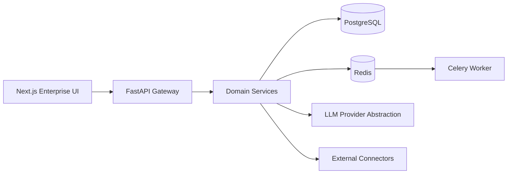
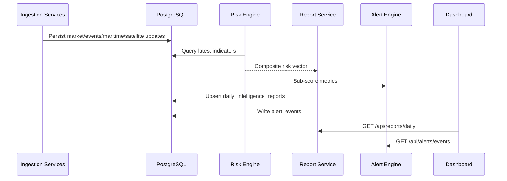

# Architecture

## Design Goals

- MVP that runs locally with mock data and no mandatory external API keys
- Modular domain boundaries for scale-out into production energy intelligence workloads
- Clear separation: models, repositories, services, schemas, routes
- Future-ready data layer for time-series (`TimescaleDB`) and geospatial (`PostGIS`) expansion

## Backend Architecture (FastAPI)

- `app/api/routes`: HTTP API contracts and endpoint orchestration
- `app/schemas`: request/response DTOs via Pydantic
- `app/services`: domain services for market, events, risk, scenarios, maritime, satellite, fields
- `app/repositories`: SQL query layer
- `app/models`: SQLAlchemy persistence model layer
- `app/clients`: connectors/adapters for external providers with mock fallback
- `app/services/llm`: provider abstraction (deterministic + OpenAI-compatible)

## Frontend Architecture (Next.js)

- App Router pages by domain (`/market`, `/events`, `/scenarios`, etc.)
- Reusable panel components (`charts`, `cards`, `timeline`, `scenario form`)
- API integration through `lib/api.ts` with safe fallbacks
- Dark enterprise UI with Tailwind + shadcn-style primitives

## Runtime Components

- PostgreSQL for relational data
- Redis for cache/queue support
- Celery worker for asynchronous jobs
- Docker Compose for local orchestration

## Platform Topology

## Daily Report and Alert Flow

## Risk Scoring Engine

Inputs:

- Event count and category distribution (recent window)
- Event sentiment and confidence
- Affected regions/assets
- Inventory movement signal
- Brent volatility proxy
- Maritime anomaly intensity

Outputs:

- Global score (0-100)
- Geopolitical, maritime, supply, demand, refinery sub-scores

## AI Layer

- `LLMProvider` abstraction avoids vendor lock-in inside domain services
- Deterministic fallback keeps the system functional with zero keys
- OpenAI-compatible provider can be replaced by Azure/Open-source adapters later

## Vector/RAG Readiness

- `EmbeddingDocument` and `VectorStoreService` provide interface for semantic retrieval
- JSON embedding fallback now
- Planned migration: native `pgvector` type and ANN indexes

## Geospatial/Time-Series Readiness

Current:

- Lat/lon + PostGIS-ready WKT/GeoJSON/SRID fields
- Alembic migration structure to initialize TimescaleDB hypertables
- Optional PostGIS geometry columns created when extension is available

Planned:

- PostGIS geometry columns and spatial indexes
- TimescaleDB hypertables for high-frequency streams (prices, AIS, sensor telemetry)

## Deployment Evolution Path

Phase 1 (current): single region, local Docker, mock connectors

Phase 2: managed Postgres/Redis + scheduler + real connectors + auth

Phase 3: streaming ingestion, feature store, model monitoring, multi-tenant controls
