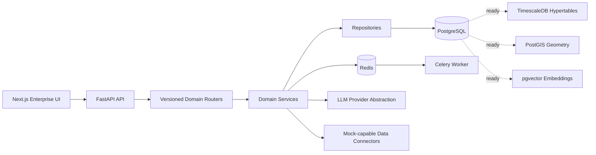

# Architecture

## Backend Layers

- `api/routes`: HTTP route modules by domain.
- `schemas`: Pydantic request and response contracts.
- `services`: business logic, scoring, reporting, AI orchestration, scenario generation.
- `repositories`: database access and query composition.
- `models`: SQLAlchemy persistence models.
- `clients`: external connectors with mock fallback behavior.

## Frontend Layers

- `app`: Next.js route pages.
- `components`: reusable UI, charts, panels, and layout.
- `lib/api.ts`: typed API client and fallback handling.
- `lib/types.ts`: TypeScript mirror of backend response contracts.

## Data Strategy

- Use PostgreSQL in local demo mode.
- Keep timestamped tables TimescaleDB-ready through Alembic migration structure.
- Keep location-heavy entities PostGIS-ready with WKT, GeoJSON, SRID placeholders and optional geometry columns.
- Keep semantic retrieval pgvector-ready through `EmbeddingDocument` and `VectorStoreService`.

## Naming Contract

Backend responses use snake_case. Frontend TypeScript types also use snake_case to avoid hidden mappings and reduce contract drift.
